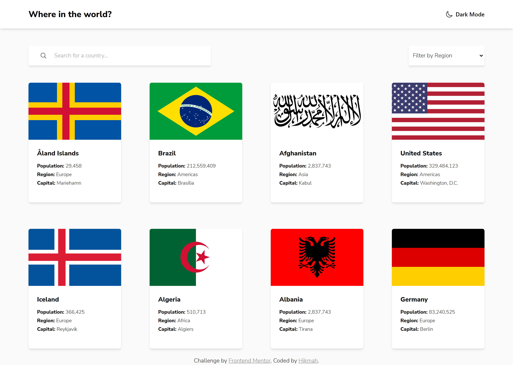

# Frontend Mentor - REST Countries API with color theme switcher solution

This is a solution to the [REST Countries API with color theme switcher challenge on Frontend Mentor](https://www.frontendmentor.io/challenges/rest-countries-api-with-color-theme-switcher-5cacc469fec04111f7b848ca). Frontend Mentor challenges help you improve your coding skills by building realistic projects. 

## Table of contents

- [Overview](#overview)
  - [The challenge](#the-challenge)
  - [Screenshot](#screenshot)
  - [Links](#links)
- [My process](#my-process)
  - [Built with](#built-with)
  - [What I learned](#what-i-learned)
  - [Useful resources](#useful-resources)
- [Author](#author)


## Overview

### The challenge

Users should be able to:

- See countries from [REST Countries API](https://restcountries.com) on the homepage
- Search for a country using an `input` field
- Filter countries by region
- Click on a country to see more detailed information on a separate page
- Click through to the border countries on the detail page
- Toggle the color scheme between light and dark mode 


### Screenshot




Above is the screenshot of my solution and below is the provided design by Frontend Mentor


### Links

- Solution URL: [Click to visit my Frontend Mentor Solution](https://www.frontendmentor.io/solutions/rest-countries-api-with-theme-switcher-using-react-and-tailwindcss-90p5Kaj7-)
- Live Site URL: [https://countries-finder-hikmahx.vercel.app](https://countries-finder-hikmahx.vercel.app/)

## My process

### Built with

- Semantic HTML5 markup
- CSS custom properties
- Flexbox
- CSS Grid
- Mobile-first workflow
- [React](https://reactjs.org/) - JS library
- [Tailwindcss](https://tailwindcss.com/) - CSS framework
- [Ionicons](https://ionicons.com) - Icons


### What I learned


#### JS

In this project, dealing with the API was a bit tricky, especially when trying to dynamically extract data for each of the cards. There were some cases where the names were different when mapping through an array of countries. For example, to get the native name, I had to do:

 ```js
 {Object.values(country.name.nativeName).at(-1).common}
 ```
And not:

```js
{country.name.nativeName.common}
```

In the former, it gets the last object in the nativeName object and gets the value of the key "common". In the later, the nativeNative contains an object and that object has a different key for each country. This makes it harder to use. If you use the first code, you would be able get the nativeName. 
Others that I had to use "Object.values(...)" for include getting the currencies and languages.
Currencies: 
```js
{Object.values(country.currencies)[0].name}
```

Languages(alphabetical):
```js
{Object.values(country.languages).sort().join(', ')}
```

#### CSS

For some reasons the row-gap doesn't work on some devices. If you experience the countries having not space between them, it is due to the row-gap not compatible with your device. I tried looking it up on the internet, but I don't see the solution to this issue.


### Useful resources

- [Stack Overflow](https://stackoverflow.com) - This helped me alot whenever I felt stuck. If you are also, just google your problem and click any of the stackoverflow link. It's very useful.


## Author

- Github - [Hikmah Yousuph](https://github.com/Hikmahx)
- Frontend Mentor - [@Hikmahx](https://www.frontendmentor.io/profile/Hikmahx)
- Email - [hikmayousuph@gmail.com](hikmayousuph@gmail.com)
- LinkedIn - [Hikmah Yousuph](linkedin.com/in/hikmah-yousuph-449467204/)